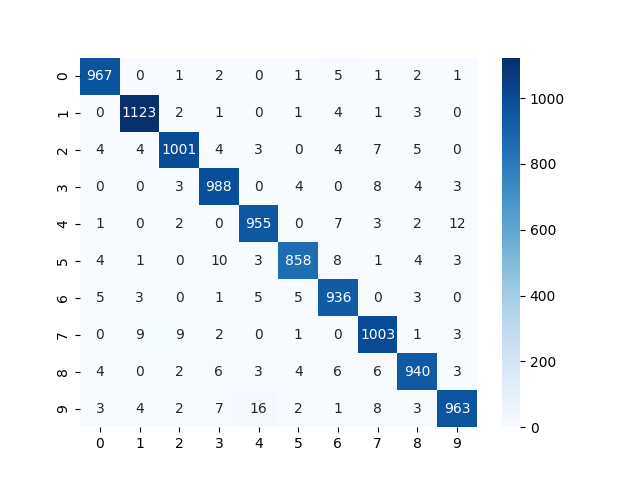
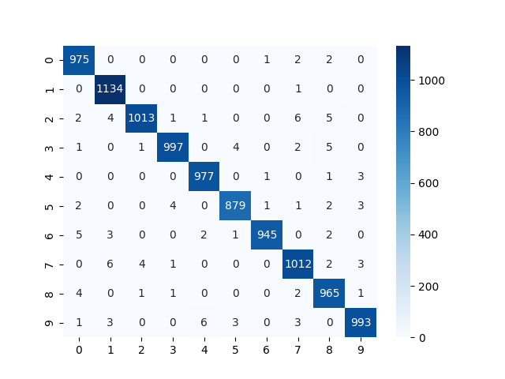

# Image classification + OOP

This repository provides 3 classification models for MNIST dataset, 
which contains images of numbers (0-9) with shape 28x28.

## Project files

```
.
├── sample_custom_data       # Images folder to simulate user input
│   └── ...  
├── src                    
│   ├── classifiers          # Classifiers Interface, Classes and MnistClassifier
│   ├── data_process         # MNIST and custom data preprocess
│   └── models               # FFN and CNN model classes
├── demo                     # Demo ipynb notebook
└── main                     # Main pipeline 

```


## Features
- Classification models:
  - **Random Forest (rf)** - scikit-learn implementation
  - **Feed-Forward Neural Network (nn)** - pytorch implementation
  - **Convolutional Neural Network (cnn)** - pytorch implementation
- Command-line interface for training, testing and predicting

## Classes overview

- **MnistClassifierInterface:** abstract class
  - Defines train, test and predict methods for classifiers 
- **RFCClassifier:** RandomForest classifier implementation
- **FFNClassifier:** Feed-Forward Neural Network implementation
- **CNNClassifier:** Convolutional Neural Network implementation
- **MnistClassifier:** Wrapper class for 3 algorithms

## Algorithms

Each algorithm has **train**, **test** and **predict** methods
- **train:** train the model on train dataset
- **test:** test the model performance on test data
  - generates classification report and confusion matrix
- **predict:** run model inference on data, passed from user

### Training results

| Model       | Hyperparameters                                   | Accuracy |
|-------------|---------------------------------------------------|----------|
| Random Forest (rf) | n_estimators=100                                  | 96.88%   |
| Feed-Forward Neural Network (nn) | epochs=15, batch_size=64, lr=0.01, optimizer=SGD  | 97.34%   |
| Convolutional Neural Network (cnn) | epochs=10, batch_size=64, lr=1e-4, optimizer=Adam | 98.90%   |

### Confusion matrices

| RF                           | FFN                           | CNN                            |   
|------------------------------|-------------------------------|--------------------------------|
|  |  |  |

## Run

:exclamation: to see confusion matrices when running pipeline with command-line - 
uncomment **matplotlib TkAgg**  in classifiers.py

Clone the repository and install requirements

```bash
  git clone https://github.com/grrvk/ItJimTask.git
  
  cd Task1
  
  pip install -r requirements.txt
```

Run pipeline

General command example is given below
```bash
  python main.py --alg [alg] --input path_to_data
```

Parameters:
- **alg** can take such values:
  - rf - Random Forest
  - nn - Feed-Forward Neural Network
  - cnn - Convolutional Neural Network
- **path_to_data** - string path to image or folder of images for inference


