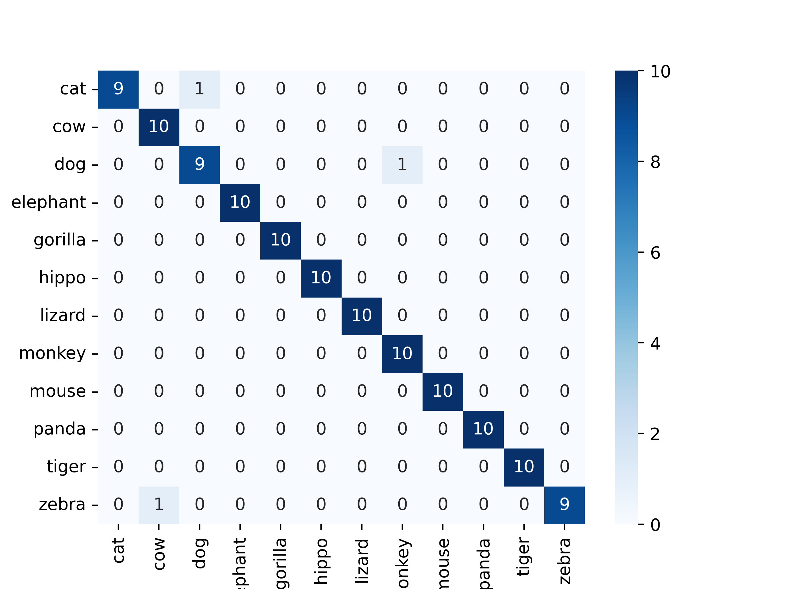

## Named entity recognition + image classification

This repository provides models for NER and Image Classification tasks, 
each coming with suitable dataset, train and inference pipelines.
Main script provides pipeline to check user input with image provided, using both models.

For current task was decided to perform classification and NER recognition on 12 animal classes:    
Cat,  cow, dog, elephant, gorilla, hippo, lizard, monkey, mouse, panda, tiger, zebra

## Project files

```
.
├── CM                               # Folder for Classification model
│   ├── CM_dataset_overview          # Jupiter notebook to overview used dataset
│   ├── cm_inference                 # Script to run inference with the model
│   ├── cm_model                     # Model class
│   ├── cm_train                     # Script to train and evaluate the model
│   └── data                         # Script to prepare data and datasets for classification task
├── NER                              # Folder for NER model
│   ├── data                         # Script to prepare data and datasets for NER task
│   ├── NER_dataset_overview         # Jupiter notebook to overview used dataset
│   ├── ner_inference                # Script to run inference with the model
│   ├── ner_model                    # Model class
│   └── ner_train                    # Script to train and evaluate the model
├── sample_input_images              # Sample images to use in demo or main
├── demo                     # Demo ipynb notebook
└── main                     # Main pipeline 

```

## Features

- Models:
  - **NER task** - distilbert-base-uncased
  - **Classification task** - google vit-base-patch16-224
- Command-line interface for training, testing and predicting
- Command-line interface for main combined pipeline

## Datasets

For both models custom datasets were created. Both datasets are available for download from [drive](https://drive.google.com/drive/folders/1MNFzjNkW4D2fayvEBL6y9u5dTNoGWwgI?usp=share_link)    
Overviews of both datasets are available in corresponding to task folders

For current training pipelines datasets are present as such:
- NER - dataset name is ner_dataset.csv, it is located in NER folder
- Image classification - datasets name is dataset, it contains train, 
  validation and test subfolders with folders of images for each class,
  it is located in CM folder 

The paths to datasets can be overwritten in data.py file for each task

## Models

For both models train and inference pipelines are available in corresponding folders.

| Task           | Loss  | Precision | Recall | F1     |
|----------------|-------|-----------|--------|--------|
| NER            | 0.004 | 0.98      | 0.99   | 0.989  |
| Classification | 0.16  | 0.976     | 0.975  | 0.9749 | 

As per classification model, result may be better after training on mode data with changed training parameters, 
but due to computational limitations 

Classification testing heatmap:
 

## Run

To run the main pipeline NER and Classifications models must be trained     
By default models are stored in **models** folder with names **ner_model** and **cm_model**

```bash
  git clone https://github.com/grrvk/ItJimTask.git
  
  cd Task2
  
  pip install -r requirements.txt
```

Run pipeline

General command example is given below
```bash
  python main.py --ner path_to_ner --cm path_to_cm --im path_to_image --txt text
```

Parameters:
- **ner** - path to NER model, default **models/ner_model**
- **cm** - path to Classification model, default **models/cm_model**
- **im** - path to image for pipeline
- **txt** - text about image for pipeline

